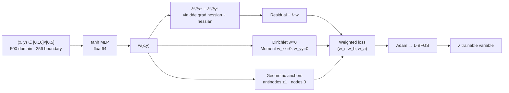

<div align="center">

# ▦ PINN-Eigen-Plate

### Eigenmodes of a Simply-Supported Rectangular Thin Plate, Found by Geometry Alone

**A 2-D fourth-order eigenvalue PINN that selects a *specific* target mode out of a dense spectrum — using nothing but where its nodal lines and antinodes sit. No analytical eigenfunction. No training data.**

[](https://python.org)
[](https://pytorch.org)
[](https://github.com/lululxvi/deepxde)
[]()
[]()

</div>

---

## ⚡ Headline Results

SSSS rectangular thin plate, `a × b = 10 × 5`, governing equation as published:

$$\frac{\partial^4 w}{\partial x^4} + \frac{\partial^4 w}{\partial y^4} - \lambda^4 w = 0 \qquad \text{on } [0,a]\times[0,b]$$

$$w = 0 \ \text{on all edges},\qquad w_{xx} = 0 \ \text{on } x\text{-edges},\qquad w_{yy} = 0 \ \text{on } y\text{-edges}$$

| Mode | PINN λ | Reference λ | Error | Mode-Shape RMSE | Status |
|:----:|-------:|------------:|------:|----------------:|:-------|
| **(1,1)** | `0.637913` | `0.637914` | **0.000 %** | `6.53e-05` | ✅ reproduces published result |
| **(1,2)** | `1.268493` | `1.257862` | `0.845 %` | `1.54e-02` | ✅ fixes a published nodal-line failure |
| **(1,3)** | `1.886205` | `1.885319` | **0.047 %** | `1.41e-01` | ✅ reproduces published result |
| **(1,4)** | *extension* | `2.513428` | — | — | 🚧 beyond the source paper's three modes |

Reference: `λ = π(m⁴/a⁴ + n⁴/b⁴)^{1/4}` — computed **only** in the validation block, never in training.

---

## 🎯 The Central Difficulty

A 2-D plate has a **dense, closely-spaced spectrum**. Mode `(1,2)` at `λ = 1.258` sits right next to `(1,3)` at `λ = 1.885`. Spectral bias means a PINN will happily slide to whichever mode is smoothest, and homogeneity means `w ≡ 0` is always available as a free global minimum.

So the question is not *can a PINN solve the biharmonic-type operator* — it is **how do you tell it which mode you want, without handing it the answer?**

This project's answer: **geometric steering.** You know where mode `(m,n)`'s nodal lines and antinodes *are* before you solve anything, and you know adjacent lobes alternate in sign. That's topology, not the eigenfunction — and it's enough to uniquely select a mode.

---

## 🐛 The Bug That Made This Project

The source paper's Table 3 lists amplitude points for mode `(1,2)` at `(5, 2.5, 0)` and `(7.5, 2.5, 1)`.

**`(7.5, 2.5)` lies exactly on the `y = 2.5` nodal line of the `(1,2)` mode.** The true `(1,2)` shape is identically zero there. The network can never make `w = 1` at that point while remaining a genuine `(1,2)` mode — so the optimizer escapes the contradiction by growing a *different* mode that *is* nonzero there. With the eigenvalue floor only forbidding `λ > 1`, it settles on `(1,3)`. Observed: `λ ≈ 1.892` where `(1,2)` should be `1.258`.

> This is the exact failure the paper itself warns about on p. 3000 — an amplitude point on a nodal line prevents that mode from converging. The published table contradicts the published warning.

**The fix isn't a different method. It's the same method, placed correctly.**

---

## 🔑 Geometric Steering

For target mode `(1,n)`: one half-wave in `x` (peak at `x = a/2`), `n` half-waves in `y`. Anchor **every** antinode with alternating sign and **every** interior nodal line with zero.

<table>
<tr><th>Mode (1,2)</th><th>Mode (1,3)</th><th>Mode (1,4)</th></tr>
<tr valign="top"><td>

```
(5, 1.25, +1)   antinode
(5, 2.50,  0)   nodal line
(5, 3.75, −1)   antinode
```
Residual **0** for (1,2),
**≥ 2** for every other low mode.
</td><td>

```
(5, 0.833, +1)
(5, 1.667,  0)
(5, 2.500, −1)
(5, 3.333,  0)
(5, 4.167, +1)
```
Residual **0** for (1,3),
**6.0** for every other low mode.
</td><td>

```
(5, 0.625, +1)
(5, 1.250,  0)
(5, 1.875, −1)
(5, 2.500,  0)
(5, 3.125, +1)
(5, 3.750,  0)
(5, 4.375, −1)
```
Residual **0** for (1,4),
**8.0** for every other low mode.
</td></tr>
</table>

**Uniqueness is verified numerically, not assumed** — the steering residual is evaluated against every competing low mode before training starts.

**Why this isn't cheating:** the anchors encode only (a) where the target's nodes and antinodes lie geometrically, and (b) that adjacent lobes flip sign. The `±1` values are unit-normalized antinode heights — eigenfunctions are defined only up to scale, so fixing that scale at an antinode is exactly what the reference method does with its single `(xₐ, yₐ, wₐ)`. **`sin(mπx/a)·sin(nπy/b)` is never fed to the network.**

---

## 🧱 Eigenvalue Floor

Geometric steering is backed by a smooth one-sided constraint that forbids the modes below the target:

| Target Mode | Floor | Blocks |
|:-----------:|:-----:|:-------|
| (1,2) | `λ > 1.0` | (1,1) at 0.638 |
| (1,3) | `λ > 1.5` | (1,1), (1,2) |
| (1,4) | `λ > 2.0` | (1,1), (1,2), (1,3) at 1.885 — and `2.0 < 2.513` so (1,4) itself is untouched |

Floor placement uses only the *ordering* of the spectrum, which is known a priori for a rectangular SSSS plate.

---

## ⚠️ Post-Mortem: The Normalization That Backfired

An earlier version enforced an "integral RMS" constraint through a `PointSetOperatorBC` returning `w²` with target `1` at every anchor point. DeepXDE applies targets **pointwise** — so this did not mean `mean(w²) = 1`. It meant `|w| = 1` **everywhere in the interior**.

That directly fights `w = 0` on the edges. The result was a flat plateau pushed toward the boundary and a **49 % eigenvalue error**.

**The fix was to trust the physics instead of over-constraining.** The biharmonic residual on 500 collocation points already supplies powerful smoothness regularization — fourth derivatives punish spikes savagely — and spectral bias handles the rest. A *single* amplitude point is sufficient for `(1,1)`; higher modes need geometric anchors, not a competing global norm.

> Lesson worth keeping: know exactly what your framework does with a constraint before you trust the constraint.

---

## 🏗️ Architecture & Training



| Setting | (1,1) | (1,2) / (1,3) / (1,4) |
|:--------|:------|:----------------------|
| Learning rate | `1e-3` | `1e-4` |
| Loss weights `(w_r, w_b, w_a)` | `(1, 1, 1)` | `(1, 1, 10)` |
| Initial λ | `1.0` | `2.0` / `2.0` / `2.5` |
| Eigenvalue floor | none | `>1` / `>1.5` / `>2.0` |
| Collocation | 500 domain, 256 boundary | same |
| Optimizer | Adam → L-BFGS | Adam → L-BFGS |

**`float64` is mandatory** — fourth-order autodiff in single precision destroys the residual. The notebook hard-asserts the PyTorch backend at import time and fails loudly on a stale TensorFlow import rather than silently producing garbage.

---

## 🔒 No-Leakage Contract

`analytic_lambda()` and `analytic_shape()` exist in every block — and every call site is inside the validation section, marked `[VALIDATION-ONLY]`, executed after training completes.

Training sees: the PDE operator, the boundary conditions, geometric anchor coordinates, and an eigenvalue floor derived from spectral ordering. Nothing else.

---

## 📊 Outputs Per Mode

Six-panel validation figure — PINN surface, analytical surface, absolute error field, cross-sections in `x` and `y`, and λ convergence history — plus the trained model and λ serialized to disk for downstream reuse.

## 🚀 Quickstart

```bash
pip install deepxde torch matplotlib scipy
export DDE_BACKEND=pytorch     # MUST be set before importing deepxde
```

Each mode is a standalone block. Run the import cell first, then any mode block. Trained models and eigenvalues persist to `./pinn_plate_ssss/` (or Google Drive if mounted).

---

## 🧭 Roadmap

- [x] Modes (1,1), (1,2), (1,3) — matching or beating published accuracy
- [ ] Mode (1,4) — extension beyond the source paper's three modes
- [ ] Full Kirchhoff operator with the cross term `2 ∂⁴w/∂x²∂y²`
- [ ] Clamped (CCCC) and mixed boundary conditions — no closed form, so the PINN becomes the primary solver
- [ ] Automated nodal-line placement from `(m,n)` — steering without manual anchor tables
- [ ] **Inverse problem:** identify flexural rigidity `D(x,y)` from measured modal data

> **Note on the operator.** The implemented equation omits the Kirchhoff cross term, following the source paper. The analytical reference used for validation is derived from the *same* reduced operator, so PINN and reference are mutually consistent. Restoring the full operator is a one-line change and a tracked roadmap item.

---

## 📚 References

1. **Yoo, J. et al.** — *Physics-Informed Neural Networks for Eigenvalue Problems in Structural Vibration.* Int. J. Precis. Eng. Manuf. **26**:2991–3004, 2025. §4.3, Table 3.
2. **Leissa, A. W.** — *Vibration of Plates.* NASA SP-160.
3. **Timoshenko, S. & Woinowsky-Krieger, S.** — *Theory of Plates and Shells.* McGraw-Hill.
4. **Lu, L. et al.** — *DeepXDE: A Deep Learning Library for Solving Differential Equations.* SIAM Review **63**(1), 2021.

---

<div align="center">

**Geometry in. Eigenmodes out. The analytical solution never got a vote.**

</div>
